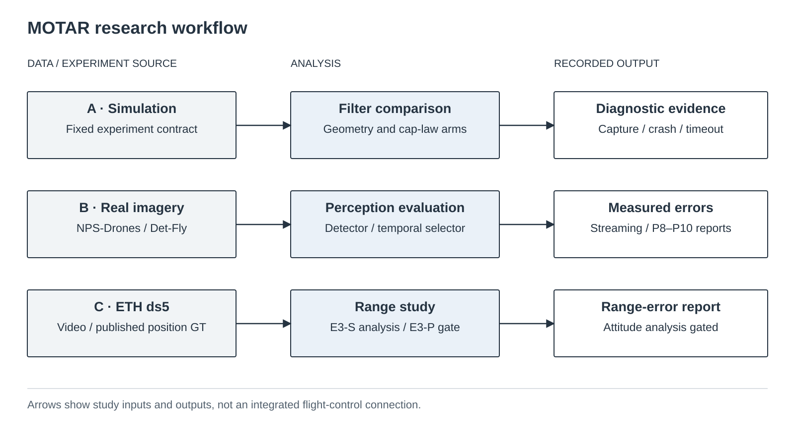

# MOTAR

Moving-target rendezvous and close-approach research in dense obstacle environments — simulation-only evidence and independent graphics tooling.



## Overview

MOTAR is a research repository for measured perception error, dense-obstacle navigation and
safety-filter diagnosis. The public quick start runs an **independent static graphics renderer**:
it does not load a detector, flight policy or simulator task.

The historical project studied UAV **interception**, with metrics named `capture` and `crash`.
Those experiments, meanings, paths and checkpoints are preserved, not renamed as evidence of a
different capability. “Rendezvous” describes the public research framing, not a validated contact
system or a change to historical success criteria.

## Research Questions

- How can measured perception uncertainty be documented without overstating generalization?
- Which assumptions limit existing safety-filter results?
- How can geometry, material and lighting be tested independently in synthetic images?
- What evidence is needed before claiming that an experiment is reproducible?

## Scope and Limitations

This repository makes **no real-flight validation claim** and provides no deployment instructions.
Independent renderer tests do not certify simulator integration, target identity or physical safety.
Historical negative and withdrawn findings remain visible in [Verification](VERIFICATION.md).
Data and code have different licensing boundaries.

## System Overview

The figure maps research inputs to analyses and recorded outputs; it is not a deployed closed loop.
[All nine diagrams and captions](docs/assets/paper/) and their
[SVG/PNG/PDF package](docs/assets/paper/motar-paper-block-diagrams.zip) remain available.
Detailed results and figures live in the [results overview](docs/results_overview_2026-09-12.md).

## Key Components

- Independent static renderer: procedural geometry, G-buffers and material/lighting variations.
- Evidence utilities: source hashes, runtime fingerprints and immutable result records.
- Historical research code and measurements: retained with experiment-specific contracts.
- Public validation: environment inventory, documentation checks and CPU-only CI.

## Repository Structure

| Path | Purpose |
|---|---|
| `tools/renderer_validation/` | Independent static graphics components |
| `tools/` | Export, benchmark, evidence and maintenance utilities |
| `tests/` | Unit, packaging, evidence and documentation checks |
| `docs/` | Installation, contracts, public checklist and research records |
| `results/` | Historical measurements and provenance, not generic training data |
| `aerial_gym/`, `resources/` | Historical simulator code and assets |

## Requirements

The supported independent CPU profile is **Linux x86-64, Python 3.8, Git**, with a new virtual
environment. It does not need Isaac Gym or a GPU. Python 3.8 is a legacy compatibility constraint,
not a recommendation for unrelated new applications. See the
[CPU profile limitations](docs/renderer_cpu_quickstart_2026-09-12.md).

The historical simulator environment is separate and has proprietary/external prerequisites.
The CPU profile does not certify its installation.

## Installation

Clone the full history; stored evidence checks refer to historical Git objects.

```bash
git clone https://github.com/joshualikaist/MOTAR.git
cd MOTAR
```

Follow [isolated CPU installation](docs/renderer_cpu_quickstart_2026-09-12.md).
Do not install the root requirements into that environment or replace a historical research environment.

## Quick Start

After activating the isolated CPU environment, run from the repository root:

```bash
PYTHONNOUSERSITE=1 CUDA_VISIBLE_DEVICES='' python -B tools/motar_doctor.py --profile renderer-cpu
PYTHONNOUSERSITE=1 CUDA_VISIBLE_DEVICES='' python -B tools/run_renderer_validation.py \
  --device cpu --seed 0 --num-scenes 1 --width 160 --height 120 --frames 2 --output /tmp/motar-smoke-new
```

The output directory must not already exist. The smoke produces generic box images and debug
buffers, **not an experiment verdict**. See [export and benchmark tooling](docs/renderer_public_tools.md).

## Training and Evaluation

There is **no training step in the public quick start**. Historical commands and their authority
are preserved in [Operations](OPERATIONS.md); a recorded command is not a new execution approval.
This release work does not modify rewards, observation schemas or checkpoints.

## Reproducing Experiments

Use the exact environment, source revision, data split and hashes named by each result.
[CPU evidence reproduction](docs/public_evidence_reproduction_2026-09-12.md) and
[renderer installation evidence](results/renderer_cpu_install_2026-09-12/README.md) distinguish
stored-result verification from a fresh rendering run. Missing evidence stays missing.

## Documentation

- [Documentation index](docs/README.md)
- [Results by track](docs/results_overview_2026-09-12.md)
- [Current verification and limitations](VERIFICATION.md)
- [Worklog](WORKLOG.md)
- [Public release checklist](docs/PUBLIC_RELEASE_CHECKLIST.md)
- [Public release audit](docs/public_release_audit_2026-09-12.md)
- [Master roadmap and blocked boundaries](docs/plans/moving_target_rendezvous_master_plan_2026-09-12.md)
- [Machine-readable status](docs/status_manifest.json) · [Research site](docs/status/)

## Citation

Use [CITATION.cff](CITATION.cff) for the software citation. No published MOTAR paper or author
identifier is invented. Cite the upstream software and datasets used by the relevant experiment
separately.

## License and Third-Party Materials

Original project code is offered under the repository's [BSD-3-Clause notice](LICENSE), subject
to retained upstream notices. This does **not** apply to every data file or dependency.
[Third-party inventory](THIRD_PARTY_LICENSES.md) identifies separate terms and unresolved items.
In particular, the ETH-derived review images are **CC BY-NC-SA 4.0**, not BSD-licensed:
[attribution and scope](results/eth_ds5_intake_2026-09-10/THIRD_PARTY_NOTICE.md).

## Acknowledgements

MOTAR derives from [Aerial Gym Simulator](https://github.com/ntnu-arl/aerial_gym_simulator) and
acknowledges NavRL, rl_games, NVIDIA Warp, urdfpy, trimesh, and the cited dataset authors.
Acknowledgement does not imply endorsement. See the third-party inventory for use and redistribution details.
