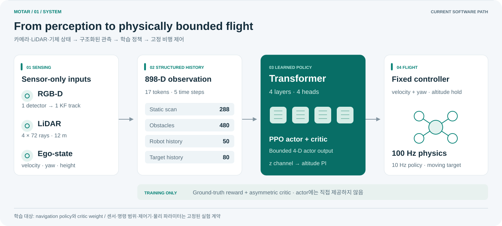
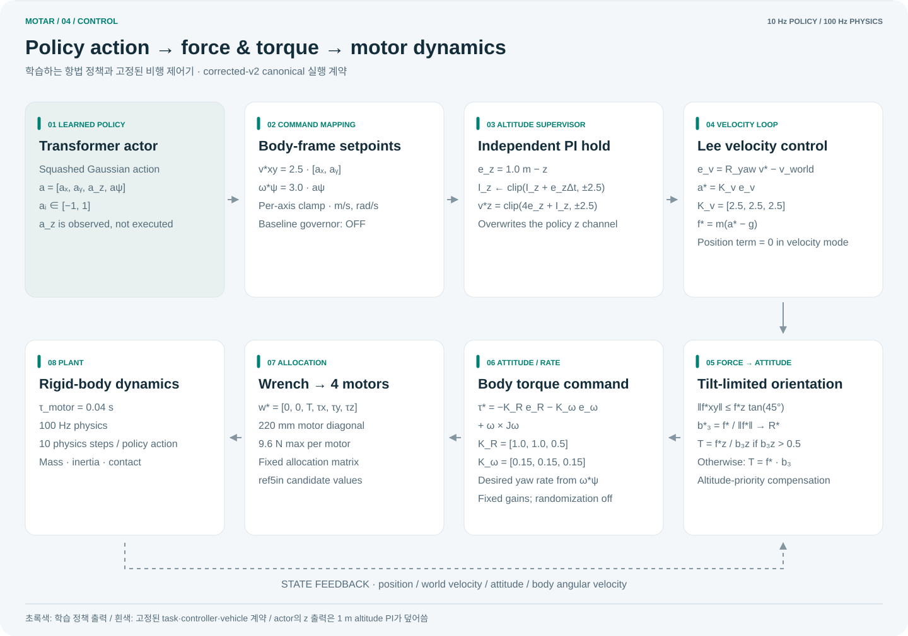

# MOTAR

**Moving-target interception in dense obstacle fields with a sensor-only UAV policy.**

MOTAR는 카메라, LiDAR, ego-state만으로 움직이는 표적을 추적하면서 장애물을 회피하는 드론 정책을
연구합니다. 최고 성공률 하나보다 **어느 조건에서 왜 capture·crash·timeout이 발생하는지**를 재현
가능한 실험 계약으로 설명하는 데 초점을 둡니다.



> **Status · 2026-08-26** — Recovery-v2 lower-1.25 passed **32/32 integrity checks** and
> **failed the route mechanism**; physical PPO and hardware claims remain **blocked**. Attempt 2
> (canonical 1.5) is a separate `FAIL_ROUTE_MECHANISM`. Packed diagnosis: recovery occupancy is
> **63% `NO_CONNECTOR`**, not v1 `unsafe_start`. 실제 기체는 아직 미조립이며 실제 센서 로그와
> 비행 데이터는 없습니다. 현재 결과는 sim-to-real 성능 주장이 아니라 재현 가능한 시뮬레이션 및
> software-only 검증입니다.

[Research site](docs/status/) · [System specification](docs/MOTAR_SYSTEM_SPEC_2026-08-24.md) ·
[Verification](VERIFICATION.md) · [Operations](OPERATIONS.md) · [Worklog](WORKLOG.md)

## Research question

> 제한된 센서 표현과 실제적인 비행 명령 범위만으로, 밀집 장애물 속 이동 표적을 얼마나 안정적으로
> 요격할 수 있으며 밀도가 증가할 때 실패 원인은 어떻게 달라지는가?

문제는 세 가지가 결합되어 있습니다.

- 빠른 추적은 표적 접근을 돕지만 제동거리와 충돌 위험을 키웁니다.
- 장애물 수가 증가하면 제한된 obstacle representation이 장면을 충분히 보존하지 못할 수 있습니다.
- 표적 미취득, 충돌, 시간 초과는 서로 다른 원인이므로 하나의 평균 reward로 합치면 진단이 흐려집니다.

## Method

| Stage | Contract |
|---|---|
| Perception | RGB-D target track + `4×72` LiDAR at 12 m + ego velocity/yaw/height |
| Representation | 898-D structured history → 17 tokens, 5 temporal samples |
| Policy | 4-layer, 4-head Transformer actor with asymmetric critic during training |
| Action | bounded body `vx/vy`, altitude hold, yaw-rate |
| Control | altitude PI + Lee velocity controller + 4-motor allocation |
| Simulation | 100 Hz physics, 10 Hz policy action, exact 600-action episode |



PPO는 navigation policy와 critic network weight를 학습합니다. 센서 geometry, observation field order,
action bound, controller gain, motor/URDF dynamics, reward coefficient는 고정된 실험 계약입니다.
Ground-truth target/vehicle state는 reward, central critic, termination 및 평가 계측에만 사용하며 actor에는
직접 제공하지 않습니다.

제어 경로는 `actor → body-frame command → altitude PI → Lee velocity loop → tilt-limited force →
attitude/rate torque → motor allocation → 100 Hz rigid-body physics` 순서입니다. Actor의 z 출력은
실행하지 않고 1 m altitude PI가 덮어쓰며, canonical baseline의 safety governor는 꺼져 있습니다.

## Current evidence

| Evidence | Result | Scope |
|---|---:|---|
| Corrected-v2 semantics | exact 600 actions, finite PPO/KL, timeout bootstrap verified | engineering smoke; held-out superiority 아님 |
| Detector navigation A/B | learned-v2 vs analytic: **−0.0145 pp**, 95% CI `[−1.752, +1.723]` | preregistered −2 pp non-inferiority margin 통과 |
| Historical static endpoint oracle | **333 / 333** selected 205-bar contact episodes had a spawn→final-target path | centre-disk oracle; global/random-pair/300-bar connectivity 및 동역학은 미포함 |
| Camera-range diagnostic | never-acquired **8.443 → 3.172%**; capture **82.235 → 88.677%** | primary −15 pp gate 미달, 따라서 inconclusive |
| Routed physical-target gate (attempt 2) | **32 / 32 integrity PASS; route mechanism FAIL; physical PPO BLOCKED** | 70-bar 4-speed pool: plan **14.55%** (gate 99%), fallback **35.93%** (gate 1%); 70 bars × 0.6 m/s: **0.25 goals/env** (gate 0.5) |
| Routed recovery forensics | **8 / 8 receipt verified; `RECOVERY_DOMINANT` (evaluation-only)** | 358 local invalidations → 35,666 local fallback intervals (`99.6257×`); unique origins `200`; hard-free/soft-unsafe `97.0%` (Wilson lower `93.61%`) |
| Recovery-v2 lower-1.25 32-cell | **32 / 32 integrity PASS; route mechanism FAIL; not a 1.5 result** | 7/32 pass (off only); 70-bar plan **93.60%**, fallback **47.87%**, 0.6 goals/env **0.21875**; `NO_CONNECTOR` occupancy **63.06%** |
| Hardware/software gate | software pipeline PASS · `SYNTHETIC_ONLY` | 실기 성능 아님 |

현재 `navrl_ref5in_quad`는 1.20 kg, 220 mm motor diagonal, 0.28 m collision proxy를 가정한
**hardware-informed simulation candidate**입니다. 저장소 정합성은 통과했지만 route mechanism은
실패했고 physical PPO는 차단되어 있습니다. 실제 BOM/CAD/관성/추력/열/전원/비행 식별값은 아닙니다.

## Canonical experiment contract

| Item | Value |
|---|---|
| Arena | `40 × 40 × 3 m`, `navrl_band` bar placement |
| Density curriculum | 70 → 300 bars, +15 steps, minimum 1,000 epochs per level |
| Target | mixed constant-velocity / waypoint, `0.3–1.5 m/s`, goal distance `6–28 m` |
| Actor observation | 898-D; static 288 + obstacle 480 + robot 50 + target 80 |
| Horizontal command | per-axis `±2.5 m/s`; yaw `±3.0 rad/s`; tilt limit `45°` |
| PPO | 128 envs, horizon 32, minibatch 2048, 4 mini-epochs, LR `3e-5` |
| Reward | range-rate, ego-progress, clearance, time, smoothness, height, capture +30, collision −20 |

Exact coefficients and their source locations are frozen in
[the system specification](docs/MOTAR_SYSTEM_SPEC_2026-08-24.md). Historical v1, archived v2, corrected-v2,
legacy robot and ref5in robot results must not be merged into one performance curve.

## Reproduce

Isaac Gym Preview 4 and an NVIDIA GPU are required. Isaac Gym itself is not redistributed here.

```bash
mkdir -p ~/workspaces/aerial_gym_ws/src
cd ~/workspaces/aerial_gym_ws/src
git clone https://github.com/joshualikaist/MOTAR.git aerial_gym_simulator
cd aerial_gym_simulator
./bootstrap_second_machine.sh
conda activate aerialgym
export PYTHONNOUSERSITE=1
```

Run the CPU contracts before using GPU time:

```bash
python tests/test_navrl_v5a_semantics_smoke.py
python tests/test_navrl_ref5in_platform.py

cd aerial_gym/rl_training/rl_games
REF5IN_PREFLIGHT_ONLY=1 ./train_navrl_v2_ref5in_smoke_c.sh
```

Held-out evaluation must use an explicit last checkpoint and record the action mode:

```bash
cd aerial_gym/rl_training/rl_games
CKPT=/absolute/path/to/last_gen_ppo_ep_XXXX_rew_YY.pth
NAVRL_V2_ACTION_MODE=deterministic \
NAVRL_V2_DENSITIES="130 160 190 205 220" \
./eval_navrl_v2_density_sweep.sh "$CKPT" 2049
```

Checkpoints are intentionally excluded from Git. Preserve the checkpoint, SHA-256, `aerial_run/`, summaries,
evaluation receipt and source manifest together. Complete installation, transfer and troubleshooting instructions
are in [OPERATIONS.md](OPERATIONS.md).

## Repository map

| Path | Purpose |
|---|---|
| `aerial_gym/task/navrl_task/` | observation, perception, reward, termination, telemetry |
| `aerial_gym/config/` | task, environment, controller and robot contracts |
| `aerial_gym/rl_training/rl_games/` | Transformer, PPO config, fixed train/eval launchers |
| `resources/robots/quad/` | URDF and collision/inertia geometry |
| `tests/` | semantics, provenance, dynamics and launcher regression tests |
| `tools/` | dataset, receipt, geometry and platform verification tools |
| `results/` | condition-specific raw evidence and summaries |
| `docs/` | system spec, execution plans, review and presentation material |

## Routed physical gate result

An isolated candidate target-motion lineage now exists under model id
`physx_ref5in_6dof_global_astar_aabb_v1`. It supplies exact-AABB, fail-closed global waypoints to
the physical target controller; it is not a planner for the pursuer and no route information is
an actor observation. Attempt 2 passed 32/32 execution-integrity checks, but the simulator route
mechanism failed: across the four 70-bar speed cells, pooled plan success was 14.55% and fallback
was 35.93%; the 70 bars × 0.6 m/s cell completed only 0.25 goals/env (gates 99%, 1%, and 0.5).
Repeated `unsafe_start` recovery trapped the
route manager in a fail-closed zero-command fallback deadlock. Motor saturation, tilt, and contact
gates passed, so they are not the supported explanation for this failure. Physical PPO remains
blocked and no PPO policy was loaded for this mechanism gate. See the
[frozen preregistration](docs/preregistration_physical_target_global_route_2026-08-25.md) and
[CPU benchmark](results/navrl_target_route_cpu_benchmark_seed825/summary.md), and
[GPU gate summary](results/navrl_physical_target_routed_gate_seed827_attempt2/summary.md).

The follow-up [route-recovery forensics result](docs/physical_target_route_recovery_result_2026-08-25.md)
separates initial planning from recovery: pooled replans were `unsafe_start=3774`, `ok=101`,
`no_path=82`, `unsafe_goal=79`, while initial plans were `ok=349`, `unsafe_start=17`,
`no_connected_goal=6`. The first unsafe replan per unique local origin gives hard-free /
soft-unsafe `97.0%` (Wilson lower `93.61%`) and exact hard-safe connector `96.5%` (lower
`92.95%`). This supports a recovery state-machine deadlock hypothesis, not a justification to
lower the frozen `0.45 m` margin or to start PPO. The diagnostic is evaluation-only and leaves
target commands, planner decisions, reward, observations, termination, PPO, and attempt2
artifacts unchanged.

The follow-up [recovery-v2 lower-1.25 gate](docs/physical_target_recovery_v2_lower1p25_result_2026-08-26.md)
is a separate speed-ceiling contract, not a 1.5 success. It also passed 32/32 integrity and
failed the route mechanism: 70-bar plan success rose to 93.60%, but fallback is 47.87% because
recovery-arm occupancy is 63% latched `NO_CONNECTOR` (0 hard-breach entries). Packed diagnosis
does not authorize retuning `0.45 m`, gain 2.5, env count, or another 32-cell run. The next
eligible GPU is the frozen [no-anchor geometry probe](docs/preregistration_physical_target_recovery_v2_no_connector_forensics_2026-08-26.md).

Fresh PPO and sim-to-real claims remain blocked until the actual platform provides measured AUW/CG, sensor
extrinsics, timestamp synchronization and real-log bearing/range/latency/dropout profiles. The next 72-hour
measurement contract is [SIM2REAL_3DAY_EXECUTION_PLAN.md](docs/SIM2REAL_3DAY_EXECUTION_PLAN.md).

## Credits

MOTAR builds on [Aerial Gym Simulator](https://github.com/ntnu-arl/aerial_gym_simulator), uses
[rl_games](https://github.com/Denys88/rl_games), and adapts ideas from
[NavRL](https://github.com/Zhefan-Xu/NavRL). Licensed under [BSD-3-Clause](LICENSE).
