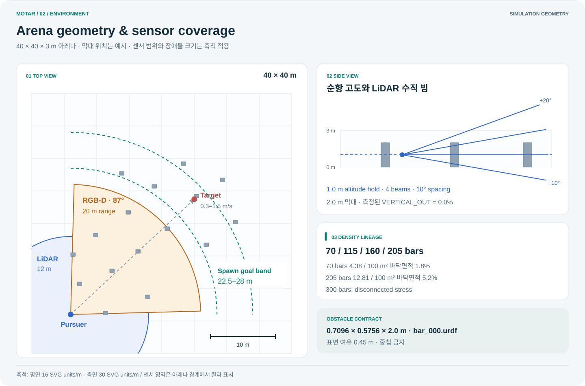
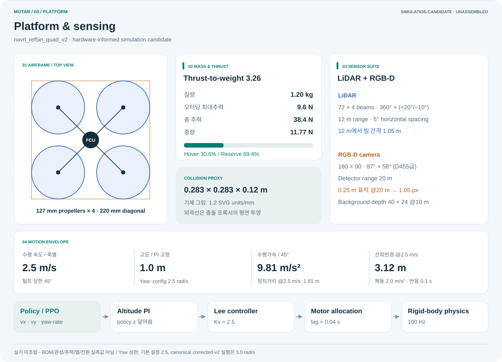
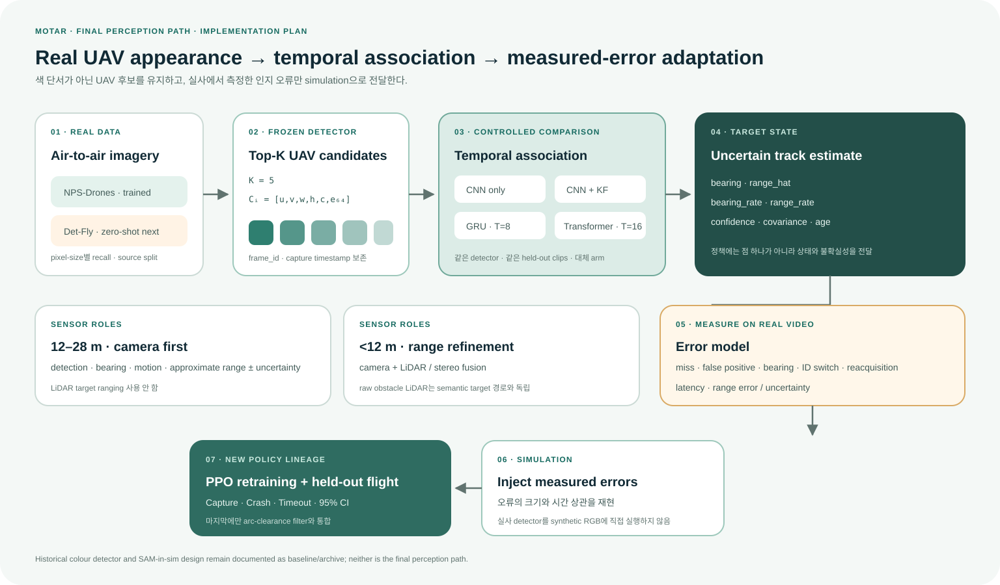

# MOTAR

**Moving-target interception in dense obstacle fields with a sensor-only UAV policy.**

MOTAR studies a drone policy that pursues a moving target while avoiding obstacles, using only a
camera, LiDAR and ego-state. The point is not a single headline success rate. It is to explain,
under a reproducible experiment contract, **which conditions produce capture, crash or timeout, and
why** — including the results that came out negative.


[Research site](docs/status/) · [System specification](docs/MOTAR_SYSTEM_SPEC_2026-08-24.md) ·
[Verification](VERIFICATION.md) · [Operations](OPERATIONS.md) · [Worklog](WORKLOG.md) ·
[Perception plan](docs/plans/perception_final_implementation_plan_2026-09-07.md)

---

## Status · 2026-09-09

Two tracks run in parallel and are at different stages.

| Track | Goal | State |
|---|---|---|
| **A — safety-filter diagnosis** | measure when and why a direction-preserving speed filter fails | core experiments complete; one training-seed replication left |
| **B — real-imagery perception** | learn a detector on real air-to-air video, measure its error, inject that into the simulator | detector, association and conditional error measurement complete; injection next |

**Recent findings.**

- **The arc tube beats the straight corridor, and it replicates.** Watching the arc the vehicle
  will actually fly, rather than a straight corridor, gives the lowest crash rate in all 15
  seed × density cells. Pooled against the risk cap: `−1.49 pp [−1.90, −1.08]` at cell level and
  `−1.49 [−2.42, −0.57]`, p = 0.020, with the seed as the replication unit.
- **Widening that tube helps twice; widening a straight corridor kills the mission.** At 205 bars
  the arc at 1.2 m gives `−5.60 pp` crash and `+4.44 pp` capture together, while the straight
  corridor at the same width captures about 10% of episodes and times out on the rest.
- **A detector trained on one dataset failed on another because of target SIZE, not domain.**
  Zero-shot from NPS-Drones to Det-Fly gave AP@0.5 of `0.0010` at native 4K; matching the target
  scale raised it to `0.1126`, a gap 111× the native value. Joint multi-scale training then took
  native AP to `0.7166`.
- **Streaming reproducibility was an environment mismatch, not non-determinism.** A candidate cache
  built under torch 2.10 / cuDNN 9.10.2 could not be reproduced under torch 2.4 / cuDNN 9.1.
  Re-running in the original environment reproduces the frozen output exactly.
- **CPU optical flow now overlaps GPU detection with identical validation output.** Across three
  complete runs per arm, candidate, rank and motion bytes all matched; decode-inclusive throughput
  increased from **14.72 to 22.48 FPS**. [Results and hashes](results/perception_streaming_overlap_s1_2026-09-09/README.md).
- **Conditional error calibration is measured.** Size-conditioned offsets, state transitions and
  timing use 1,310 single-GT validation frames. Another 986 frames contain multiple GT boxes;
  unsupported size/cadence regions remain explicit. [P8 artifacts and limits](results/perception_p8_2026-09-09/README.md).

**What this project does not claim.** Real-flight performance, sim-to-real transfer, target
identification, 30 FPS, or an assembled airframe. Every number here is simulation or software-only
verification. The vehicle is not built, and there are no real sensor logs.

---

## Research question

> With a limited sensor representation and a realistic flight-command envelope, how reliably can a
> moving target be intercepted in a dense obstacle field, and how do the failure modes change as
> density rises?

Three problems are entangled:

- Faster pursuit closes on the target but lengthens braking distance and raises collision risk.
- As obstacle count rises, a bounded obstacle representation may stop preserving the scene.
- Never-acquired, collision and timeout have different causes, so averaging them into one reward
  hides the diagnosis.

## Arena and platform



A 40 × 40 × 3 m arena holds 0.7096 × 0.5756 × 2.0 m bars. The lineage densities are
**70 / 115 / 160 / 205** (70 bars = 4.38 per 100 m², 205 bars = 12.81 per 100 m²); 300 is a
disconnected stress case. Goals sit in a **22.5–28 m** band from spawn and the target moves at
0.3–1.5 m/s. The LiDAR circle (12 m) and the camera wedge (87°, 20 m) in the figure are drawn to
scale, and that is the figure's point: **how little of the arena the sensors see.**

The side view settles one thing. Bars are 2.0 m tall and cruise altitude is 1.0 m, so **a bar
always intersects some LiDAR beam.** That is why contact forensics report `VERTICAL_OUT` at
exactly **0.0%**.



`navrl_ref5in_quad_v2` is **1.20 kg, 220 mm motor diagonal, 127 mm propellers, 9.6 N per motor**.
Total thrust 38.4 N against 11.77 N of weight gives **TWR 3.26**, with hover at 30.6% of thrust.
The motion envelope follows: 9.81 m/s² horizontal acceleration at 45° tilt, and at 2.5 m/s a
**1.81 m stopping distance and 3.12 m turning radius**.

These are a **hardware-informed simulation candidate**, not measurements. The airframe is not
assembled and there is no measured BOM, inertia, thrust, thermal or power data.

## Method

| Stage | Contract |
|---|---|
| Perception · current | 160×90 RGB-D single detector → single KF target track + `4×72` LiDAR at 12 m |
| Representation | 898-D structured history → 17 tokens, 5 temporal samples |
| Policy | 4-layer, 4-head Transformer actor with an asymmetric critic during training |
| Action | bounded body `vx/vy`, altitude hold, yaw rate |
| Control | altitude PI + Lee velocity controller + 4-motor allocation |
| Simulation | 100 Hz physics, 10 Hz policy action, exactly 600 actions per episode |


PPO trains the navigation policy and critic weights. Sensor geometry, observation field order,
action bounds, controller gains, motor/URDF dynamics and reward coefficients are a **fixed
experiment contract**. Ground-truth target and vehicle state are used only for reward, the central
critic, termination and evaluation instrumentation — never as an actor input.

The control path is `actor → body-frame command → altitude PI → Lee velocity loop → tilt-limited
force → attitude/rate torque → motor allocation → 100 Hz rigid-body physics`. The actor's z output
is not executed; a 1 m altitude PI overrides it. The speed governor's canonical train and eval
default is `off` on both sides.

---

## Safety filter — the speed governor

> **Naming.** This is an **arc-clearance speed filter**. It is not a DWA planner and it is not a
> collision-safety guarantee. The current implementation has a reproducible counterexample: an
> obstacle inside the disk the arc sweeps can go undetected. The numbers below measure **this
> implementation**.


The governor selects LiDAR returns inside a **straight corridor of half-width 0.45 m around the
commanded direction**, takes the minimum forward distance as `clearance`, and applies one cap law
to **the magnitude of the horizontal command only**. It never changes direction; the policy chooses
direction.

Measured on the frozen ep25000 policy (seed 49, 205 bars, 2,049–2,051 episodes per cell):

| mode | capture | crash | timeout | intervention | contact speed |
|---|---:|---:|---:|---:|---:|
| off | 73.16% | 25.18% | 1.66% | 0% | 3.044 m/s |
| **fixed 2.0** | 81.31% | **14.06%** | 4.64% | 95.67% | 1.972 m/s |
| riskcap | 81.71% | 15.95% | 2.34% | 25.66% | 2.024 m/s |
| stopcap | 69.19% | 21.31% | 9.51% | 36.85% | 0.302 m/s |
| ttc | 74.70% | **4.24%** | 21.06% | 55.94% | 0.255 m/s |

**Collisions are not longitudinal braking failures.** `stopcap` removes the speed floor, cuts speed
just before contact from `2.024 → 0.302 m/s` and makes the stopping margin at contact **positive**
(`−0.026 → +0.395 m`) — and crash still **rose** from `15.95 → 21.31%`. At the moment of contact the
filter's own safety model says "I can stop". The obstacle being hit is therefore **not inside the
corridor**. The corridor has four blind spots: lateral (outside the half-width), vertical (z is
unregulated), unknown space (a ray with no return is treated as free), and the straight-line
assumption itself.

### Replacing the corridor with an arc (replicated across three evaluation seeds)

Blind spot four — the straight-line assumption — is the one that pays. The vehicle turns at a yaw
rate, so the space it will actually pass through is an **arc tube**, not a straight corridor.
Replacing the watched region with that arc (`dwa_arc`) and changing nothing else:

| contrast (crash, pp) | cell-level pool (n = 15) | **seed-level** (k = 3, t) |
|---|---|---|
| arc − risk cap | −1.49 [−1.90, −1.08] | **−1.49 [−2.42, −0.57]**, p = 0.020 |
| arc − stopping law | −1.25 [−1.65, −0.85] | **−1.26 [−1.96, −0.55]**, p = 0.017 |
| stopping law − risk cap | −0.23 [−0.65, +0.20] | −0.22 [−1.82, +1.38], p = 0.608 |

The arc had the lowest crash rate in **all 15** seed × density cells. Because the five densities
inside one seed share a policy, a scene sampler and an RNG stream, the cell-level interval is a
precision statement about those cells; the seed-level interval is the one that speaks to a new
seed. It is three times wider and **still excludes zero**, which is what makes the generalisation
arguable. Split by density, the seed-level intervals mostly cover zero, so individual densities are
reported descriptively and only the density-pooled effect carries a claim.

**Width moves in opposite directions depending on geometry.** Widening the arc from 0.45 to 1.2 m
buys `−5.60 pp` crash and `+4.44 pp` capture *together* at 205 bars. Widening the straight corridor
to the same 1.2 m collapses capture to about 10% with the rest timing out. One knob ties frontal
over-intervention to lateral coverage in a straight corridor; the arc does not look far ahead while
turning, so the knob comes untied.

**Which cap law is right depends on what the policy was trained with.** A policy trained without a
governor is helped by the stopping-distance law (`−6.5 / −5.5 / −3.9 pp` crash against the risk
cap). Put the risk cap in the training loop for 1,000 more epochs and that advantage is no longer
detectable (`+0.48 pp [−1.82, +2.78]`). A small residual difference appears at 70 bars but does not
survive a seed-level analysis (`−1.20 [−3.06, +0.66]`), so it is kept as an exploratory
observation, not a prescription.

**Current recommendation: train without the filter, deploy the arc tube widened to about 1.2 m.**
The training-seed replication that would let the co-adaptation claim be stated generally is the one
experiment still outstanding.

Preregistration and verdicts: [confirmation plan](docs/plans/confirmation_phase_plan_2026-09-06.md).
Reproduce the pooled numbers with:

```bash
python tools/pool_navrl_seed_replication.py \
  results/navrl_grid_d1p_ep25000_seed523 results/navrl_grid_l1_ep25000_seed523 \
  results/navrl_grid_r1_seedrep_ep25000_s527 results/navrl_grid_r1_seedrep_ep25000_s531
```

---

## Perception — the real-imagery path



The final design learns UAV appearance from **real air-to-air video** and associates per-frame
Top-K candidates over time. Target perception at 12–28 m is camera-driven; LiDAR target ranging is
not used. Inside 12 m, camera and LiDAR/stereo correct the range. Raw obstacle LiDAR and the
arc-clearance filter stay independent of the semantic target estimate. The implementation order and
completion conditions are frozen in
[`perception_final_implementation_plan_2026-09-07.md`](docs/plans/perception_final_implementation_plan_2026-09-07.md).

### Why the in-simulator detector was abandoned


The figure above is an **archived design candidate**, kept for the record. It never entered the
control loop and is not a performance claim. Two reasons replaced it.

1. **The simulated target has no shape information.** What the detector sees is an analytic sphere
   of radius 0.15 m painted a constant colour, and one of the three decoy types is a sphere of the
   same radius. The background is upsampled 40×24 depth shading with no texture and no lighting.
   There is no quadrotor mesh anywhere in this repository.
2. **Detectors trained on simulated imagery do not transfer.** A tiny-YOLOv4 trained in a general
   simulator reaches mAP 37.2% in real low light against 96.4% for a real-image baseline
   (Ning et al., *Unmanned Systems* 2024). Our renderer is worse than that "general simulator".

### The current in-sim detector is a known failure, quantified


The in-sim detector is not YOLO. `AppearanceTargetSegmenter` classifies RGB-D pixels with **a single
1×1 convolution** (`R·3 − G·2 − B·2 − 0.9`), and `_detect_rgbd` **collapses every positive pixel
into one centroid**. With no connected components there is always exactly one candidate, associated
to a LiDAR return (`bearing ±15°`, `range ±0.55 m`).

The measured defect: **it cannot separate a second object of the same colour.**

| detector | N=1 | N=3 | N=5 | verdict |
|---|---:|---:|---:|---|
| default (5-parameter colour rule) | 52.7% | 79.7% | 88.5% | `COLOR_SHORTCUT_CONFIRMED` |
| **v7 (11,329-parameter learned CNN)** | 60.7% | 83.1% | **90.3%** | `COLOR_SHORTCUT_CONFIRMED` |

v7, whose frame precision is `0.99766`, locks the wrong object in **90.27%** of visible frames when
five same-coloured decoys are present. **This table quantifies a defect; it is not an improvement.**
Comparing false-target-lock rates *between* detectors is forbidden — different trajectories give
different frame distributions (prereg §3-c L6).

Three preregistered experiments converged on the same conclusion:

| what changed | effect on the preregistered metric | verdict |
|---|---:|---|
| **data structure** — connected components, multi-candidate, χ²(3) gating | none (shadow FTLR **+1.3 pp**) | `RECOGNITION_DOMINANT` |
| **range variance** — physically correct quadratic model (2.3× at 20 m) | none (capture **−0.34 pp**, CI [−3.19, +2.51]) | `VARIANCE_INSENSITIVE` |
| **which object is locked** — five same-coloured decoys | FTLR **90.27%** | `COLOR_SHORTCUT_CONFIRMED` |

**The binding constraint is object identity, not measurement quality.** Measuring more precisely, or
managing candidates better, does not move it.

### Real-imagery detector: zero-shot failure, then a fix

**Step 1 — train on NPS-Drones.** 640 px tiles (19,659 train / 4,096 val), YOLOv5s, 40 epochs.
mAP50 peaks at epoch 13 and then flattens: the mean over epochs 12–40 is `0.549 ± 0.015` and the
0.579 peak sits two standard deviations up that band, so **the model's real level is about 0.55**
and 0.579 carries the optimism of selecting and reporting on the same validation set. Training loss
fell 25.1% over that span while validation loss fell 0.7%. More epochs do not help.

**Step 2 — zero-shot to Det-Fly (P3), all 13,271 images, two arms frozen before results.**

| IoU 0.5 | native 4K | scale-matched ÷4 |
|---|---:|---:|
| AP | **0.0010** | **0.1126** |
| recall | 0.087 | 0.234 |

The gap is **111× the native value**, so the preregistered rule reads the dominant cause as
**size**. The evidence is the size breakdown: at native scale the detector finds 4 of 4,961 targets
in the 64–128 px band and **0 of 2,151** above it, and 54% of Det-Fly boxes are above 64 px.
Det-Fly targets have a median diagonal of 109 px against 25 px in the NPS training tiles — three
quarters of them are larger than 95% of what the model was trained on. A domain component remains:
0.1126 is 19% of the same model's 0.579 on NPS.

**Step 3 — joint multi-scale training (P3-F).** Warm-started from the NPS checkpoint, 30 epochs on a
joint NPS + Det-Fly dataset with multi-scale enabled, seed 0, checkpoint selected on validation and
frozen by SHA-256 before the test was opened. On Det-Fly it reaches **native AP@0.5 0.7166, recall
0.839**.

> **Do not read 0.0010 → 0.7166 as before-and-after of one experiment.** P3 is a zero-shot sweep by
> a model that never saw Det-Fly; P3-F is validation for a model trained on Det-Fly's `010` group.
> 0.7166 is evidence that fixing the scale problem works, not a generalisation figure. The gap that
> remains after scale correction is a **residual domain gap** — background, compression, viewpoint
> and optics are all still in there.

Precision at the 0.25 operating threshold is `0.2729`, so the threshold still needs calibrating on
validation, not on the test set.

### Temporal association

On the same frozen detector and the same Top-K = 5 candidates, four alternatives were compared on
NPS validation (2,296 frames, 7 clips) using a fixed utility `(hit − proxy false lock) / frames`:

| arm | utility | outcome |
|---|---:|---|
| CNN only | 0.6655 | baseline |
| Kalman filter v1 | 0.2639 | **REJECTED** (test hit 0.4655 vs 0.6145; false lock 0.4843 vs 0.2450) |
| GRU, T = 8 | 0.6315 | not selected |
| Temporal Transformer, T = 16 | 0.6725 | selected |
| **P7c v2** (candidate preservation + motion/GMC) | **0.68554** | **selected** |

The margins are small and the validation set has seven clips, so this is a selection, not a
superiority claim. **The NPS test set has been opened once, for the KF rejection, and not since.**
The joint dataset's test split is sealed and absent from the training YAML.

The `appearance_64D` field is a parameter-free RGB grid/histogram baseline, not learned ReID. With
no ground-truth track IDs and no camera intrinsics, this project does not report real ID switches,
degree-valued bearing error, or metric range.

### Streaming pipeline

Frame → detector → motion/GMC → temporal selector runs serially at **14.9 FPS including decode**
(detector 26.4 ms, motion 33.4 ms, selector 2.4 ms, decode 5.2 ms).

A reproducibility failure here is worth recording because the cause was not what it looked like.
Re-detecting from RGB disagreed with the frozen candidate cache on 5 of 2,296 frames, which read
like non-determinism and was chased through TF32, cuDNN benchmark and deterministic flags. It was
none of those: **the cache was produced under torch 2.10 / cuDNN 9.10.2 and the re-run used torch
2.4 / cuDNN 9.1**, and the two stacks select different convolution kernels — bit-identical over 60
frames in the first environment, up to 45% apart in confidence in the second. Re-running the full
2,296-frame audit in the original environment gives `rank_mismatches 0` and metrics identical to the
cached replay.

Receipts now record the interpreter and accelerator stack (`tools/runtime_fingerprint.py`), and
`OPERATIONS.md` rule 0.1 makes that mandatory for any receipt carrying GPU numbers.

Profiling the motion stage shows **Farnebäck optical flow is 97.7%** of it (36.58 ms) while GMC
RANSAC is 0.17 ms. Since the flow depends only on the two grayscale frames and candidates enter
afterwards, it can overlap the GPU detector; a measured prototype gives 112.3 ms serial against
74.7 ms overlapped with the flow array bit-identical. Applying that is the next perception step,
and the phrase "bit-identical" will only be used for the pipeline once all 2,296 frames agree on
ranks, on the motion feature arrays and on every downstream metric.

---

## External data — what can and cannot be used

Training perception on real data makes **licensing a design constraint**: a result trained on
unclear terms can be invalidated at publication. All links were checked on 2026-09-04. Storage
headroom, not compute, governs the choices.

| Asset | Licence | Size | Viewpoint | State |
|---|---|---:|---|---|
| [NPS-Drones](https://engineering.purdue.edu/~bouman/UAV_Dataset/) | **BSD-3-Clause** | 2.04 GB | air-to-air | **in use**; 70,250 frames, targets 10×8–65×21 px |
| [Det-Fly](https://github.com/Jake-WU/Det-Fly) | **MIT** | 18.85 GB unpacked | air-to-air | **in use**; 13,271 images at 3840×2160 |
| [MIDGARD](https://mrs.fel.cvut.cz/midgard) | no statement | 3.53 GB | air-to-air | not obtained; **has range GT**, useful for the error model; written permission advisable |
| [DUT Anti-UAV](https://github.com/wangdongdut/DUT-Anti-UAV) | Apache-2.0 | 1.32 GB | ground-to-air | not obtained; viewpoint mismatch, OOD set only |
| [AOT](https://registry.opendata.aws/airborne-object-tracking/) | CDLA-Permissive-1.0 | 13.4 TB | air-to-air | full download impossible; 2–3 sequences feasible |

Blocked: **ARD100** (Baidu-only distribution, GPL-3.0 code that infects derivatives), **ARD-MAV**
(14.6 GB zip exceeds headroom), **Drone-vs-Bird/WOSDETC** (no public link, signed agreement
required), **FL-Drones** (contradictory licensing — no licence text means default copyright, so it
cannot go in a paper without written permission).

Pretrained weights do not let us skip training: a public air-to-air detector (GLAD, trained on
ARD-MAV) evaluated zero-shot on NPS-Drones reaches AP **0.045** against 0.80 in-domain.

`ultralytics/yolov5` is **AGPL-3.0**. Evaluating with it is unencumbered; publishing code built on
top of it would make our code AGPL as well. That constrains detector architecture choices.

---

## Evidence table

| Evidence | Result | Scope |
|---|---:|---|
| Arc geometry, three evaluation seeds | **arc lowest crash in 15/15 cells**; pooled −1.49 pp, seed-level −1.49 [−2.42, −0.57] | ep25000 lineage, 5 densities, 2,049 ep/cell |
| Arc tube widening | 205 bars crash −5.60 pp **and** capture +4.44 pp | 3 seeds; straight corridor collapses to ~10% capture |
| Co-adaptation (D4) | stopping-law advantage not detectable after training with the filter (+0.48 pp) | **one training seed**; replication outstanding |
| Contact forensics | **77–78% of bar collisions are outside the watched corridor** | lateral 57–58% + no-return 20%; longitudinal failure 1 in 5 |
| Detector colour shortcut | both detectors `COLOR_SHORTCUT_CONFIRMED`; v7 FTLR **90.27%** at N=5 | seed 479, 8 cells, 2,049 ep/cell |
| NPS→Det-Fly zero-shot (P3) | `SIZE-DOMINANT ZERO-SHOT FAILURE`; native AP@0.5 **0.0010**, ÷4 **0.1126** | 13,271 images, frozen checkpoint |
| Joint multi-scale detector (P3-F) | validation mAP50 **0.6917**; Det-Fly native AP@0.5 **0.7166** | checkpoint frozen before the test was opened |
| Top-K candidates (P4) | **PASS** | schema, semantics and hashes verified on val and test |
| Temporal association (P5–P7c) | KF **REJECTED**; P7c v2 selected at utility **0.68554** | validation only; NPS test not opened since P5 |
| Streaming pipeline | implemented; RGB parity **PASS** after environment fix | 14.9 FPS with decode; not a camera deployment |
| Detector navigation A/B | learned-v2 vs analytic **−0.0145 pp**, CI `[−1.752, +1.723]` | passes the preregistered −2 pp non-inferiority margin |
| Camera-range diagnostic | never-acquired **8.443 → 3.172%** | short of the −15 pp gate, therefore inconclusive |
| Route-off held-out | capture **83.70% @70 → 65.54% @145** | seed 313; no 205-bar or routed claim |
| Routed physical gate | **32/32 integrity PASS; route mechanism FAIL; PPO blocked** | plan 14.55% vs 99% gate; fallback 35.93% vs 1% |
| Hardware/software gate | software pipeline PASS · `SYNTHETIC_ONLY` | not a real-flight result |

Historical v1, archived v2, corrected-v2, legacy-robot and ref5in-robot results **must not be merged
into one performance curve**. Results from before 2026-08-27 overlapped nearby bars into compound
obstacles and are kept as historical evidence only.

---

## Canonical experiment contract

| Item | Value |
|---|---|
| Arena | `40 × 40 × 3 m`; footprint-aware non-overlap placement with `0.45 m` surface clearance |
| Density curriculum | route-off run: planned 70 → 205 bars in steps of 15, stopped at 145; asset ceiling 300 |
| Target | route-off lineage: mixed constant-velocity/waypoint, `0.3–1.25 m/s`; routed gate: waypoint-only, `0.3–1.5 m/s`. The two lineages are never merged |
| Actor observation | 898-D: static 288 + obstacle 480 + robot 50 + target 80 |
| Horizontal command | per-axis `±2.5 m/s`; yaw `±3.0 rad/s`; tilt limit `45°` |
| PPO | 128 envs, horizon 32, minibatch 2048, 4 mini-epochs, LR `3e-5` |
| Reward | range-rate +1, ego-progress +1, static safety +1.5, visibility +0.02/visible step, time −0.05/step, smoothness −0.1, height −8, yaw alignment −0.3, yaw-rate² −0.02, capture +30, collision overwrite −20 |

Exact coefficients and their source locations are frozen in the
[system specification](docs/MOTAR_SYSTEM_SPEC_2026-08-24.md).

**Working rules that came out of accidents**, in [OPERATIONS.md](OPERATIONS.md):

- **§0 one working branch** — all work is on `main`; the GitHub default and the Pages source must
  both be `main /docs`, or a push changes nothing on the site.
- **§0.1 receipts record the execution stack** — Python, torch, CUDA, cuDNN, OpenCV, numpy and the
  flags that change kernel selection. Omitting this cost a day of chasing phantom non-determinism.
- **§8-A checkpoints are never deleted by hand** — `tools/audit_checkpoint_references.py` derives
  what must be kept from the evidence that cites it, and keeps anything it does not recognise.
- **Frozen paths are untouchable while an evaluation runs** — editing `aerial_gym`, `tools` or
  `resources/robots` mid-run voids the remaining cells.

## Reproduce

Isaac Gym Preview 4 and an NVIDIA GPU are required. Isaac Gym itself is not redistributed here.

```bash
mkdir -p ~/workspaces/aerial_gym_ws/src
cd ~/workspaces/aerial_gym_ws/src
git clone https://github.com/joshualikaist/MOTAR.git aerial_gym_simulator
cd aerial_gym_simulator
./bootstrap_second_machine.sh
conda activate aerialgym
export PYTHONNOUSERSITE=1
```

Run the CPU contracts before spending GPU time:

```bash
python tests/test_navrl_v5a_semantics_smoke.py
python tests/test_navrl_ref5in_platform.py

cd aerial_gym/rl_training/rl_games
REF5IN_PREFLIGHT_ONLY=1 ./train_navrl_v2_ref5in_smoke_c.sh
```

Held-out evaluation must name an explicit last checkpoint and record the action mode:

```bash
cd aerial_gym/rl_training/rl_games
CKPT=/absolute/path/to/last_gen_ppo_ep_XXXX_rew_YY.pth
NAVRL_V2_ACTION_MODE=deterministic \
NAVRL_V2_DENSITIES="130 160 190 205 220" \
./eval_navrl_v2_density_sweep.sh "$CKPT" 2049
```

Multi-condition sweeps go through the grid runner, which re-checks that the frozen paths are
committed before every cell:

```bash
python tools/run_navrl_filter_grid.py docs/specs/<spec>.json results/<root>
python tools/summarize_navrl_grid.py results/<root>
```

Checkpoints are excluded from Git. Preserve the checkpoint, its SHA-256, `aerial_run/`, the
summaries, the evaluation receipt and the source manifest together. Full installation, transfer and
troubleshooting instructions are in [OPERATIONS.md](OPERATIONS.md).

## Repository map

| Path | Purpose |
|---|---|
| `aerial_gym/task/navrl_task/` | observation, perception, reward, termination, telemetry |
| `aerial_gym/config/` | task, environment, controller and robot contracts |
| `aerial_gym/rl_training/rl_games/` | Transformer, PPO config, fixed train/eval launchers |
| `resources/robots/quad/` | URDF and collision/inertia geometry |
| `tests/` | semantics, provenance, dynamics and launcher regression tests |
| `tools/` | dataset, receipt, geometry, statistics and verification tools |
| `results/` | condition-specific raw evidence and summaries |
| `docs/` | system spec, execution plans, preregistrations and the research site |

## Status of the routed target lineage

An isolated target-motion lineage exists under `physx_ref5in_6dof_global_astar_aabb_v1`. It supplies
exact-AABB, fail-closed global waypoints to the physical target controller. It is not a planner for
the pursuer, and no route information reaches the actor's observation.

Attempt 2 passed 32/32 execution-integrity checks and **failed the route mechanism**: across the
four 70-bar speed cells, pooled plan success was 14.55% and fallback 35.93%, and the 70 bars ×
0.6 m/s cell completed 0.25 goals per environment (gates 99%, 1% and 0.5). Repeated `unsafe_start`
recovery trapped the route manager in a fail-closed zero-command deadlock. Motor saturation, tilt
and contact gates all passed, so they are not the explanation. A corrected non-overlap re-run
(seed 829) failed the same way, with plan 17.78% and fallback 30.02%.

Forensics separate initial planning from recovery: pooled replans were `unsafe_start=3774`,
`ok=101`, `no_path=82`, `unsafe_goal=79`, while initial plans were `ok=349`, `unsafe_start=17`,
`no_connected_goal=6`. The first unsafe replan per unique origin gives hard-free/soft-unsafe
**97.0%** (Wilson lower 93.61%). This supports a recovery state-machine deadlock, and it does
**not** authorise lowering the frozen `0.45 m` margin or starting PPO.

**Physical PPO stays blocked** until a real platform supplies measured AUW/CG, sensor extrinsics,
timestamp synchronisation, and real-log bearing/range/latency/dropout profiles.

## Credits

MOTAR builds on [Aerial Gym Simulator](https://github.com/ntnu-arl/aerial_gym_simulator), uses
[rl_games](https://github.com/Denys88/rl_games), and adapts ideas from
[NavRL](https://github.com/Zhefan-Xu/NavRL). Licensed under [BSD-3-Clause](LICENSE).
