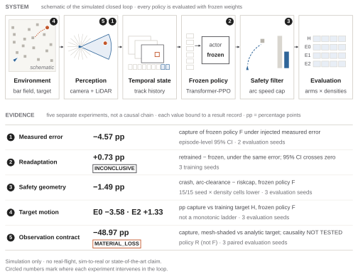
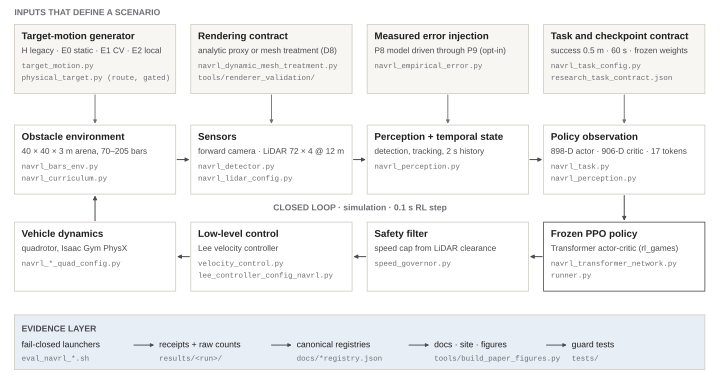

# MOTAR

**MOTAR: Moving Object Tracking And Rendezvous**<br>
*Reinforcement Learning for UAV Tracking and Close Approach in Random Obstacle Fields*

MOTAR studies how perception uncertainty, safety-filter geometry, target-motion distribution shift and observation changes affect frozen UAV tracking and close-approach policies in random obstacle fields. All policy evaluations are simulation-only.



**Main finding:** target-motion effects replicated under a bias-corrected evaluation. Against the
target motion the policy was trained on, a static target scored **−5.37 pp** capture, a
constant-velocity target **−3.45 pp** and an obstacle-aware target **+1.35 pp**: an independent replication with 7 fresh seeds and 229,376 primary episodes.
*Simulation only; no real-flight or state-of-the-art claim.*

## Why MOTAR?

MOTAR measures perception error on real footage, injects it into a frozen policy, and separately varies safety geometry, target motion and rendering. This research evidence sequence is not a causal
chain. Preregistrations and deviations are linked from [`docs/EVIDENCE.md`](docs/EVIDENCE.md); negative, inconclusive and withdrawn results remain available.

## Key Results

| Question | Result | Status and limit |
| --- | --- | --- |
| Target motion vs the training target | static **−5.37 pp** · constant velocity **−3.45 pp** · obstacle-aware **+1.35 pp** capture | Independent bias-corrected replication, policy F, 7 fresh seeds; all three contrasts replicated. The obstacle-aware gain was not uniform at high density. The original 3-seed campaign stays as historical evidence |
| Measured perception error → policy | **−4.57 pp** capture, 95 % CI [−6.32, −2.82] | Policy F; episode-level interval from two evaluation seeds at one density; one injector |
| Readaptation under that error | **+0.73 pp**, 95 % CI [−1.04, +2.50] | **INCONCLUSIVE**: no net benefit established; 3 training seeds |
| Safety-filter geometry | **−1.4903 pp** crash; seed-level 95 % CI [−2.42, −0.57] | Policy F, 3 evaluation seeds; lower in 15/15 seed × density cells, which are not independent replicates. Configured contrast; not a safety guarantee |
| Observation contract | **−48.967 pp** capture | **MATERIAL_LOSS**; causality **NOT_TESTED**; policy R (a different checkpoint), 3 evaluation seeds |
| Perception range error on real footage | **6.2 %** median of 9 block medians | One flight (9 blocks of 15 s; 3,107 frames, not independent samples); apparent-size proxy |

pp = percentage points. Two frozen checkpoints carry these results: policy F (ep25000 + riskcap) and,
for the observation contract only, policy R (ref5in D1 ep1900). No external result is compared numerically: Class A matched comparisons = 0.

## System



A forward camera and a LiDAR feed perception, which keeps a short track history. A Transformer PPO
policy, frozen for every evaluation, turns 17 observation tokens into a velocity command. A LiDAR
speed filter caps that command before a Lee velocity controller flies the quadrotor. Ground-truth
target state never enters the policy's observation. The scenario inputs (target motion, rendering
contract, measured-error injection) are the factors the experiments vary. Details and source paths:
[`ARCHITECTURE.md`](ARCHITECTURE.md).

## Target-motion replication

**CURRENT · REPLICATED.** 7 fresh evaluation seeds (4104–4110), 4 arms × 4 densities,
112 cells × 2,048 primary episodes = 229,376 primary episodes. No PPO training. H is historical training-lineage motion; E0 is static; E1 is bounded constant velocity;
E2 is bounded obstacle-aware waypoint motion. Capture rates: H 87.76% · E0 82.39% · E1 84.32% · E2 89.12%.

| Capture contrast (pp), BCa95 | Original n=3: legacy window | Replication n=7: per-environment quota |
| --- | --- | --- |
| E0 − H | −3.58 [−4.04, −3.29] | −5.37 [−5.78, −4.85] |
| E1 − H | −2.82 [−3.53, −2.44] | −3.45 [−3.79, −3.11] |
| E2 − H | +1.33 [+1.15, +1.50] | +1.35 [+1.07, +1.87] |

All three preregistered directional contrasts replicated; each has 7/7 seeds in the same direction,
exact p = 0.015625 and Holm-adjusted p = 0.046875. The Holm-adjusted p-values are 0.046875, at the resolution boundary of the seven-seed exact sign-flip design. Effect sizes, confidence intervals, and seed-level consistency must therefore be reported alongside the hypothesis tests.

The aggregate E2−H contrast replicated, but its positive direction was not uniformly expressed at the two highest obstacle densities: 5/7 seeds at 160 bars and 4/7 at 205 bars. Density-specific analyses remain exploratory.

Original campaign (18 September, n=3, legacy pooled stopping window); bias discovery and canary (instrumentation validation, not scientific evidence); independent replication (25–26 September, n=7, corrected per-environment quota). These stages remain separate and are never pooled.

Within the seven-seed replication, the historical pooled stopping window attenuated all three capture contrasts toward zero. The estimator change does not by itself explain the full difference between the original n=3 campaign and the n=7 replication because the seed sets differ.

[Figure 4](docs/assets/paper/final/fig4-target-motion.svg) shows every seed and both campaigns.
[Full record](results/target_motion_replication_7seed/README.md) ·
[Canonical status](results/target_motion_replication_7seed/summary.json) ·
[Analysis](results/target_motion_replication_7seed/analysis.json).

## Repository Structure

| Path | Contents |
| --- | --- |
| `aerial_gym/` | Simulator and the MOTAR task: environment, sensors, perception, policy, safety filter, control |
| `tools/` | Public tools (environment doctor, renderer, figure and document builders) and experiment scripts |
| `tests/` | Contract, evidence and documentation guards |
| `results/` | One immutable folder per experiment: receipts, raw counts, summaries, VOID runs |
| `docs/` | Evidence, reproducibility, operations, history, preregistrations; the site in `docs/status/` |

## Quick Start

**PUBLIC_CPU validation:** 0 failures / 0 errors; GPU-only tests are excluded.

The supported public path is CPU-only: Linux x86-64, Python 3.8, Git, and a new virtual environment. It needs no GPU and no Isaac Gym, and runs no policy.

```bash
git clone https://github.com/joshualikaist/MOTAR-public.git MOTAR && cd MOTAR
# create and activate the isolated CPU environment: docs/renderer_cpu_quickstart_2026-09-12.md
export PYTHONNOUSERSITE=1 CUDA_VISIBLE_DEVICES=''
python -B tools/motar_doctor.py --profile renderer-cpu
python -B tools/run_renderer_validation.py --device cpu --seed 0 --num-scenes 1 \
  --width 160 --height 120 --frames 2 --output /tmp/motar-smoke-new
python -B -m unittest discover -s tests -p 'test_public*.py'
```

The smoke test renders generic boxes and debug buffers. It is not an experiment verdict. The recorded results are verified from their receipts rather than re-run, as described in
[`docs/REPRODUCIBILITY.md`](docs/REPRODUCIBILITY.md). The historical simulator environment is
separate: it needs a GPU and Isaac Gym Preview 4, which NVIDIA distributes and which cannot be redistributed here.

The target-motion measurement source is `b1c0bc6`. GPU-only evaluation requires the pinned simulator environment; cross-machine bitwise reproducibility has not been established.
Raw replication evidence stays outside normal Git history; the
[manifest and archive SHA](results/target_motion_replication_7seed/replication_record.json) are retained.

## Research Evidence

Every result, its interval, its record and its limit are on one page:
[**`docs/EVIDENCE.md`**](docs/EVIDENCE.md). The public site has a project page and a full evidence
page ([`docs/status/`](docs/status/index.html)); historical figures remain in the
[figure overview](docs/results_overview_2026-09-12.md).

## Documentation

- [`PROJECT.md`](PROJECT.md): purpose, questions, scope and phase.
- [`ARCHITECTURE.md`](ARCHITECTURE.md): how the system connects and which directories may change.
- [`docs/EVIDENCE.md`](docs/EVIDENCE.md): what is established, and what is not.
- [`docs/REPRODUCIBILITY.md`](docs/REPRODUCIBILITY.md): environments, data availability, verification.
- [`docs/OPERATIONS.md`](docs/OPERATIONS.md): everyday commands and run rules.
- [`docs/HISTORY.md`](docs/HISTORY.md): milestones and the negative record.
- [`AGENTS.md`](AGENTS.md) and [`DESIGN_SYSTEM.md`](DESIGN_SYSTEM.md): rules for contributors, the site
  and the figures.

## Limitations

> MOTAR is **simulation-only** research on moving-target rendezvous (tracking and close approach in
> a simulated obstacle field). It makes **no real-flight validation claim**, no sim-to-real claim and
> no state-of-the-art claim, and it provides no deployment instructions. The historical experiments
> were framed as interception; their metric names (`capture`, `crash`) keep their original meaning,
> and "rendezvous" does not reinterpret them. Each effect holds only inside its recorded contract:
> checkpoint, arena, densities and seeds. Readaptation is INCONCLUSIVE, the D8b cause is NOT_TESTED,
> and persistent target identity and metric range are BLOCKED by missing ground truth.

Additional boundaries: Class A matched external benchmarks = 0; target-motion inference uses
7 independent evaluation seeds, and density-specific E2 effects are exploratory. Persistent physical
target identity remains unsupported. The minimum-distance metric is **WITHHELD_SEMANTIC_MISMATCH**:
capture uses swept closest approach within a step, while the recorded distance is sampled at step end. Several raw datasets and artifacts are not distributed in normal Git.

## Citation and license

Cite the software with [`CITATION.cff`](CITATION.cff). No MOTAR paper has been published, and no
author identifier is invented. Cite the upstream software and datasets used by an experiment separately.

**License.**

Original code is offered under the repository's [BSD-3-Clause notice](LICENSE), subject to the retained upstream notices. This does not cover every data file or dependency; see the
[third-party inventory](THIRD_PARTY_LICENSES.md). ETH ds5 images are not redistributed and must be
obtained separately under CC BY-NC-SA 4.0 ([external data](docs/external_data/ETH_DS5.md)).

MOTAR derives from [Aerial Gym Simulator](https://github.com/ntnu-arl/aerial_gym_simulator) and
acknowledges NavRL, rl_games, NVIDIA Warp, urdfpy, trimesh and the cited dataset authors. Acknowledgement does not imply endorsement.
