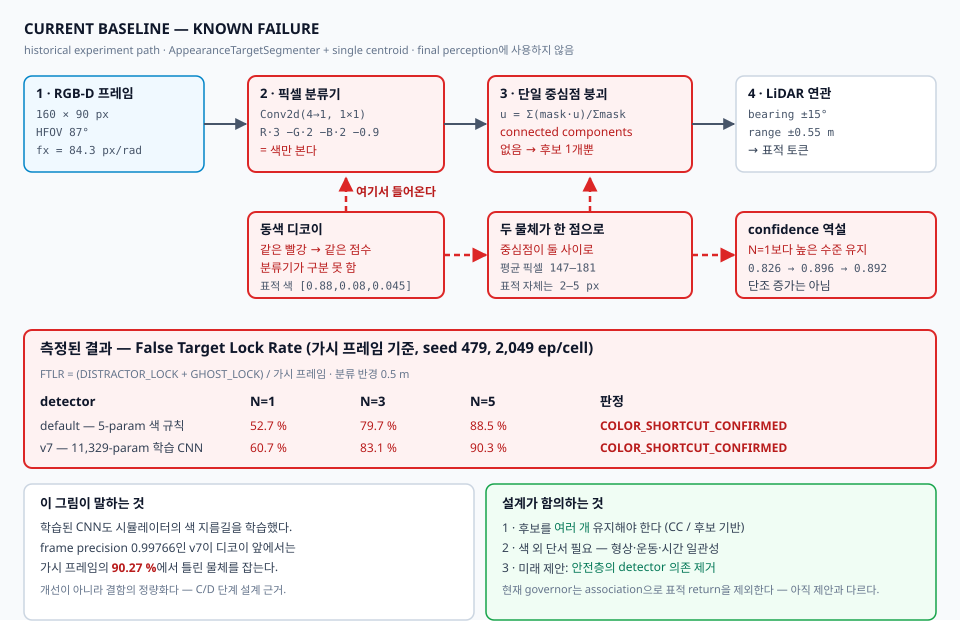
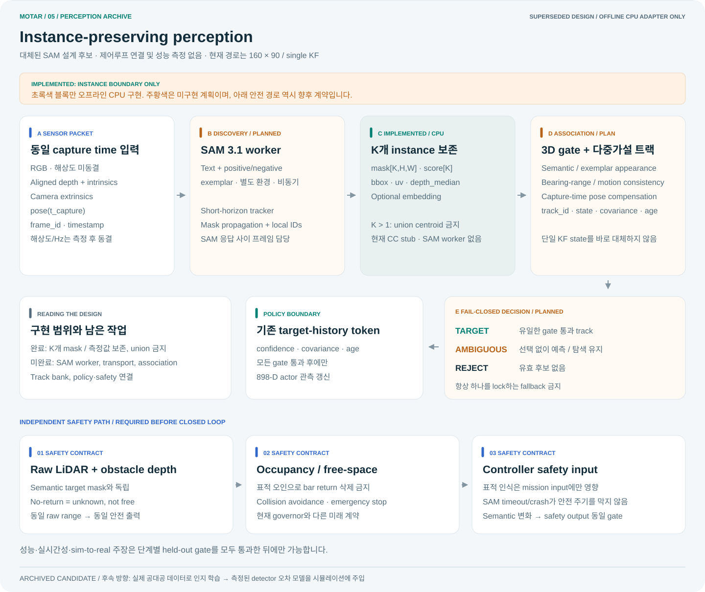
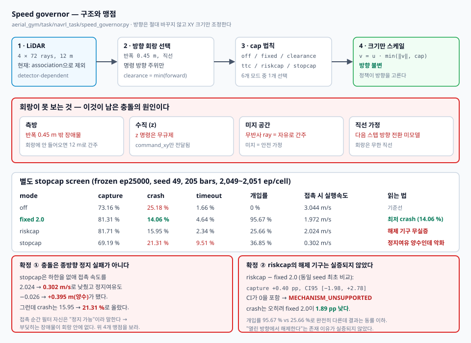

# MOTAR

**Moving-target interception in dense obstacle fields with a sensor-only UAV policy.**

MOTAR는 카메라, LiDAR, ego-state만으로 움직이는 표적을 추적하면서 장애물을 회피하는 드론 정책을
연구합니다. 최고 성공률 하나보다 **어느 조건에서 왜 capture·crash·timeout이 발생하는지**를 재현
가능한 실험 계약으로 설명하는 데 초점을 둡니다.


> **Status · 2026-09-03** — The corrected non-overlap **route-off** lineage completed a fresh
> 500-epoch learning-viability smoke, then a fresh seed-911 density curriculum. The curriculum was
> stopped at epoch 21,973 after reaching 145 bars (not 205). A sealed seed-313 held-out sweep measured
> capture **83.70% at 70 bars → 65.54% at 145 bars**; timeout stayed below 0.4% and the loss was mostly
> bar contact. This is one incomplete route-off policy, not 205-bar mastery. The separate routed gate
> still fails its mechanism contract, so routed PPO remains blocked.
> Track A remains P2 `STRICT FAIL`, D1 `FAIL`, P3 `BLOCKED`, and detection Stage 1
> `RANGE_INCONCLUSIVE_AT_THIS_BUDGET`; its only next authority is the
> [real-hardware/offline 72-hour contract](docs/SIM2REAL_3DAY_EXECUTION_PLAN.md). 실제 기체는 아직
> 미조립이며 실제 센서 로그와
> 비행 데이터는 없습니다. 현재 결과는 sim-to-real 성능 주장이 아니라 재현 가능한 시뮬레이션 및
> software-only 검증입니다. 별도의 SAM instance 후보는 현재 **offline CPU adapter까지만 구현**됐으며
> SAM worker, 제어루프 연결 및 성능 측정은 아직 없습니다.

[Research site](docs/status/) · [System specification](docs/MOTAR_SYSTEM_SPEC_2026-08-24.md) ·
[Blind-search & autonomous-evader plan](docs/plans/target_search_and_adversarial_evader.md) ·
[SAM perception verification plan](docs/SAM3_PERCEPTION_VERIFICATION_PLAN_2026-09-03.md) ·
[Verification](VERIFICATION.md) · [Operations](OPERATIONS.md) · [Worklog](WORKLOG.md)

교수님 발표를 다시 만들 때는 [PPT master brief](docs/CLAUDE_PPT_MASTER_BRIEF_2026-08-26.md)를
최상위 계약으로 사용한다. 이 문서는 hardware 예상치, high/low-level 구조, reward/PPO/curriculum,
최종 Track A/B 판정과 발표 claim boundary를 한곳에 묶는다.

## Research question

> 제한된 센서 표현과 실제적인 비행 명령 범위만으로, 밀집 장애물 속 이동 표적을 얼마나 안정적으로
> 요격할 수 있으며 밀도가 증가할 때 실패 원인은 어떻게 달라지는가?

문제는 세 가지가 결합되어 있습니다.

- 빠른 추적은 표적 접근을 돕지만 제동거리와 충돌 위험을 키웁니다.
- 장애물 수가 증가하면 제한된 obstacle representation이 장면을 충분히 보존하지 못할 수 있습니다.
- 표적 미취득, 충돌, 시간 초과는 서로 다른 원인이므로 하나의 평균 reward로 합치면 진단이 흐려집니다.

## Method

| Stage | Contract |
|---|---|
| Perception · current | 160×90 RGB-D single detector → single KF target track + `4×72` LiDAR at 12 m |
| Representation | 898-D structured history → 17 tokens, 5 temporal samples |
| Policy | 4-layer, 4-head Transformer actor with asymmetric critic during training |
| Action | bounded body `vx/vy`, altitude hold, yaw-rate |
| Control | altitude PI + Lee velocity controller + 4-motor allocation |
| Simulation | 100 Hz physics, 10 Hz policy action, exact 600-action episode |


PPO는 navigation policy와 critic network weight를 학습합니다. 센서 geometry, observation field order,
action bound, controller gain, motor/URDF dynamics, reward coefficient는 고정된 실험 계약입니다.
Ground-truth target/vehicle state는 reward, central critic, termination 및 평가 계측에만 사용하며 actor에는
직접 제공하지 않습니다.

제어 경로는 `actor → body-frame command → altitude PI → Lee velocity loop → tilt-limited force →
attitude/rate torque → motor allocation → 100 Hz rigid-body physics` 순서입니다. Actor의 z 출력은
실행하지 않고 1 m altitude PI가 덮어씁니다. Speed governor의 canonical train/eval 기본값은 모두
`off`입니다. 아래 필터 수치는 frozen ep25000 정책을 별도 stopcap screen에서 `off`, `fixed`,
`riskcap`, `stopcap`, `ttc`로 비교한 결과이며 일반 평가 계약이 아닙니다.

## Current evidence

| Evidence | Result | Scope |
|---|---:|---|
| Corrected-v2 semantics | exact 600 actions, finite PPO/KL, timeout bootstrap verified | engineering smoke; held-out superiority 아님 |
| Detector navigation A/B | learned-v2 vs analytic: **−0.0145 pp**, 95% CI `[−1.752, +1.723]` | preregistered −2 pp non-inferiority margin 통과 |
| Historical static endpoint oracle | **333 / 333** selected 205-bar contact episodes had a spawn→final-target path | centre-disk oracle; global/random-pair/300-bar connectivity 및 동역학은 미포함 |
| Camera-range diagnostic | never-acquired **8.443 → 3.172%**; capture **82.235 → 88.677%** | primary −15 pp gate 미달, 따라서 inconclusive |
| Routed physical-target gate (attempt 2) | **32 / 32 integrity PASS; route mechanism FAIL; physical PPO BLOCKED** | 70-bar 4-speed pool: plan **14.55%** (gate 99%), fallback **35.93%** (gate 1%); 70 bars × 0.6 m/s: **0.25 goals/env** (gate 0.5) |
| Routed recovery forensics | **8 / 8 receipt verified; `RECOVERY_DOMINANT` (evaluation-only)** | 358 local invalidations → 35,666 local fallback intervals (`99.6257×`); unique origins `200`; hard-free/soft-unsafe `97.0%` (Wilson lower `93.61%`) |
| Recovery-v2 lower-1.25 32-cell | **32 / 32 integrity PASS; route mechanism FAIL; not a 1.5 result** | 7/32 pass (off only); 70-bar plan **93.60%**, fallback **47.87%**, 0.6 goals/env **0.21875**; `NO_CONNECTOR` occupancy **63.06%** |
| Recovery-v2 no-anchor follow-up | **`INCONCLUSIVE`; Track B closed** | primary `n=1`; observer identity disagreement `0`; no further GPU/PPO/retune/rerun authority |
| Corrected non-overlap route gate r2 | **32 / 32 integrity PASS; route mechanism FAIL; routed PPO blocked** | 70-bar plan **17.78%**, fallback **30.02%**, 0.6 goals/env **0.21875**; routed speed gate passed at no density |
| Corrected route-off fresh smoke | **500 epochs; `PASS_LEARNING_VIABILITY`** | seed 907, 70 bars fixed, target `U[0.3,1.25]`; held-out 성능 주장이 아님 |
| Corrected route-off curriculum | **epoch 21,973에서 운영자 중지; 145 bars 도달** | fresh seed 911; 70→85→100→115→130→145, 160/205 미도달 |
| Corrected route-off held-out | **83.70% capture @70 → 65.54% @145** | seed 313, 6 trained-density cells; [summary](results/navrl_corrected_nonoverlap_physical_off_heldout_seed313/summary.md); no 205/routed claim |
| Detector colour shortcut (distractor envelope) | **both detectors `COLOR_SHORTCUT_CONFIRMED`**; v7 FTLR **90.27%** at N=5 | seed 479, 8 cells, 2,049 ep/cell; cross-detector comparison forbidden (prereg §3-c) |
| Speed-governor stopcap screen | **Q1 `MECHANISM_UNSUPPORTED`, Q3 `FILTER_DEPENDENT`, stopcap NO-GO** | seed 49, 5 arms, 2,049 ep/cell; riskcap does not beat a constant 2.0 m/s cap |
| Hardware/software gate | software pipeline PASS · `SYNTHETIC_ONLY` | 실기 성능 아님 |

새 physical lineage의 `navrl_ref5in_v2_quad`는 1.20 kg, 220 mm motor diagonal, 0.283 m collision proxy를 가정한
**hardware-informed simulation candidate**입니다. route-off PPO는 145 bars까지 학습·평가됐지만
routed mechanism은 실패해 routed PPO가 차단돼 있습니다. 실제 BOM/CAD/관성/추력/열/전원/비행
식별값은 아닙니다.

## Perception — how the target is detected



탐지기는 YOLO가 아닙니다. `AppearanceTargetSegmenter`는 **1×1 conv 하나**로 RGB-D 픽셀을 분류하고
(`R·3 − G·2 − B·2 − 0.9`), `_detect_rgbd`가 **양성 픽셀 전부를 하나의 중심점으로 붕괴**시킵니다.
connected components가 없으므로 후보는 언제나 1개이고, 그 중심점을 LiDAR return과 연관시켜
(`bearing ±15°`, `range ±0.55 m`) 표적 토큰을 만듭니다.

이 설계에는 측정된 결함이 있습니다. **동색 물체가 하나 더 있으면 구분하지 못합니다.**

| detector | N=1 | N=3 | N=5 | verdict |
|---|---:|---:|---:|---|
| default (5-param colour rule) | 52.7% | 79.7% | 88.5% | `COLOR_SHORTCUT_CONFIRMED` |
| **v7 (11,329-param learned CNN)** | 60.7% | 83.1% | **90.3%** | `COLOR_SHORTCUT_CONFIRMED` |

frame precision `0.99766`인 v7이 디코이 앞에서는 가시 프레임의 **90.27%**에서 틀린 물체를 잡습니다.
confidence는 N=1/3/5에서 `0.826 → 0.896 → 0.892`였습니다. N=1보다 높은 수준을 유지하지만 N에
따라 단조 증가하지는 않습니다. `count`가 후보별 값이 아니라 양성 픽셀의 합이라는 구조적 문제는
남습니다. 평균 픽셀 수 147–181인데 표적 자체는 2–5 px입니다.

**이 결과는 개선이 아니라 결함의 정량화입니다.**
detector 간 FTLR/outcome 비교는 금지입니다(서로 다른 궤적 → 서로 다른 프레임 분포, prereg §3-c L6).
원자료: [`summary`](results/navrl_detector_distractor_envelope_seed479/summary.md).

### 세 실험이 같은 결론으로 수렴했습니다

원인이 무엇인지를 세 갈래로 각각 사전등록하고 측정했습니다.

| 무엇을 바꿨나 | 사전등록 지표의 효과 | 판정 |
|---|---:|---|
| **자료구조** — connected components 다중 후보 + χ²(3) 게이팅 | 없음 (shadow FTLR **+1.3 pp**) | `RECOGNITION_DOMINANT` |
| **거리 측정 분산** — 물리적으로 옳은 2차 모델(20 m에서 2.3배) | 없음 (capture **−0.34 pp**, CI [−3.19, +2.51]) | `VARIANCE_INSENSITIVE` |
| **어느 물체를 lock 하는가** — 동색 디코이 5개 | FTLR **90.27%** (N=0 대비 N=5) | `COLOR_SHORTCUT_CONFIRMED` |

세 번째 행의 판정 지표는 **FTLR**이다. 같은 셀의 capture는 68.13% → 12.64%로 떨어지지만
그 원값은 **판정에 쓰지 않는다** — distractor가 다섯 코드 경로에서 자유 공간으로 남아 있어
distractor 충돌이 미귀속 contact로 기록되고 정적 goal이 distractor 안에 놓일 수 있다
([envelope summary](results/navrl_detector_distractor_envelope_seed479/summary.md) §L5).
방향은 명확하지만 크기는 교란돼 있다.

**구속 조건은 측정 품질이 아니라 물체 동일성(identity)입니다.** 더 정밀하게 재도, 후보를 더 잘
관리해도 달라지지 않습니다. 사전등록:
[S1 구조 수정](docs/prereg_2026-09-03_s1_structure_fix_shadow.md) ·
[깊이 잡음 차수](docs/prereg_2026-09-04_depth_noise_model_order.md) ·
[디코이 envelope](docs/prereg_2026-09-01_distractor_envelope.md).

### 대체된 방향 — 시뮬 내 형상 detector 학습



위 그림은 **설계 후보였고, 측정으로 대체됐습니다.** 제어루프에 들어간 적이 없고 성능 주장도
아닙니다. 초록색 `INSTANCE BOUNDARY`만 오프라인 CPU 계약으로 구현돼 있습니다.

대체 사유는 두 가지입니다.

1. **표적에 형상 정보가 없습니다.** detector가 보는 표적은 반지름 0.15 m의 **해석적 구**에 상수색
   `[0.88, 0.08, 0.045]`를 칠한 것이고, 디코이 3종 중 하나는 **같은 반지름의 구**입니다
   (`env_object_config.py:938`). 배경은 40×24 depth를 업샘플한 회색 명암이며 텍스처도 조명도
   없습니다. 저장소 전체에 쿼드로터 메쉬가 존재하지 않습니다.
2. **시뮬 이미지로 학습한 detector는 전이되지 않습니다.** 일반 시뮬로 학습한 tiny-YOLOv4는
   실제 저조도에서 mAP **37.2%**인 반면 실사진 기반은 96.4%입니다(Ning et al., *Unmanned Systems*
   2024). 우리 렌더러는 그 "일반 시뮬"보다 열악합니다.

따라서 인지는 **실제 공대공 데이터로 학습**하고, 시뮬은 그 detector의 **측정된 오차 모델**을
주입해 정책을 학습시키는 구조로 갑니다. 아래 [External data](#external-data--what-we-have-what-we-cannot-get)
참조.

## External data — what we have, what we cannot get

인지를 실제 공대공 데이터로 학습하기로 한 이상, **무엇을 합법적으로 쓸 수 있는가**가 설계 제약이
됩니다. 라이선스가 불명확한 데이터로 학습한 결과는 게재 단계에서 무효가 될 수 있으므로, 조사
결과를 여기에 남깁니다. 모든 링크는 2026-09-04에 직접 확인했습니다.

기기 제약: 여유 저장 공간 **약 15 GB**(RAM이 아니라 SSD). 이것이 규모 선택을 지배합니다.

### 확보했거나 확보 가능 (라이선스 안전)

| 자산 | 라이선스 | 규모 | 시점 | 상태 |
|---|---|---:|---|---|
| [NPS-Drones](https://engineering.purdue.edu/~bouman/UAV_Dataset/) | **BSD-3-Clause** | 2.04 GB (영상) | 공대공 | 확보 중. 70,250 프레임 · 1920×1080 · 표적 10×8–65×21 px |
| [Det-Fly](https://github.com/Jake-WU/Det-Fly) | **MIT** | 9.34 GB | 공대공 | 미확보 — 여유 공간 부족. 13,271장 · 3840×2160 · 배경 4종 |
| [MIDGARD](https://mrs.fel.cvut.cz/midgard) | 명시 없음 (인용 요청만) | 3.53 GB | 공대공 | 미확보. **거리 GT 포함** — 오차 모델에 유용. 서면 허락 권장 |
| [DUT Anti-UAV](https://github.com/wangdongdut/DUT-Anti-UAV) | **Apache-2.0** | 1.32 GB | 지상→공중 | 미확보. 시점 불일치, OOD 세트로만 가치 |
| [AOT](https://registry.opendata.aws/airborne-object-tracking/) | **CDLA-Permissive-1.0** | **13.4 TB** | 공대공 | 전량 불가. 부분 prefix로 2–3 시퀀스(~3 GB)만 가능. 흑백 + 유인기 표적 |

MIDGARD의 `nasmrs.felk.cvut.cz` 링크는 **TLS 인증서가 깨져 있습니다**(altname에 `k`가 없음).
`nasmrs.fel.cvut.cz`를 쓰면 정상입니다.

### 구하고 싶지만 지금은 불가능

| 자산 | 막힌 이유 |
|---|---|
| **ARD100** (YOLOMG) | Baidu 전용 배포, 규모 미공개(추정 20–40 GB). 코드가 **GPL-3.0**이라 파생 코드에 전염. 평균 표적 면적 0.01%로 우리 영역에 가장 가까운 데이터인데 접근이 막힘 |
| **ARD-MAV** (GLAD) | zip **14.6 GB** — 압축 해제 전에 이미 여유 초과. 저장 공간이 늘면 1순위 |
| **Drone-vs-Bird / WOSDETC** | 공개 링크 **없음**. `wosdetc@googlegroups.com`에 요청해 **데이터 사용 동의서 서명** 필요, 처리 기간 미공지. 게다가 지상→공중이라 시점 불일치 |
| **FL-Drones** | **라이선스 모순.** EPFL은 공개 Drive 링크를 두는데 TransVisDrone 저자는 "저자 허락 필요"라고 명시. 라이선스 문구가 없으므로 기본 저작권이 적용됨 → **서면 허락 없이 논문에 넣으면 안 됨** |

### 사전학습 가중치 — 학습을 건너뛸 수 있는가

| 레포 | 가중치 | 라이선스 | 비고 |
|---|---|---|---|
| [GLAD](https://github.com/WindyLab/Global-Local-MAV-Detection) | ✅ `yolov5s_GLAD.pt` (14.4 MB) | ⚠️ **LICENSE 파일 없음** (README 배지만) | ARD-MAV 학습 = 우리 영역과 일치. TensorRT 엔진은 하드웨어 종속이라 사용 불가, `.pt`만 유효 |
| [TransVisDrone](https://github.com/tusharsangam/TransVisDrone) | ✅ NPS/FL/AOT 3종 | **MIT** | 라이선스가 가장 깨끗. 단 **시간 모델**이라 연속 5프레임 필요 |
| [YOLOMG](https://github.com/Irisky123/YOLOMG) | ❌ 없음 | GPL-3.0 | 직접 학습해야 하는데 ARD100 접근이 막힘 |
| [C2FDrone](https://github.com/Sairam13001/C2FDrone) | ❌ 없음 | 없음 | 재현 불가 |

`ultralytics/yolov5`는 **AGPL-3.0**입니다. 평가만 하면 무관하지만, 그 소스 위에 만든 코드를
공개하면 우리 코드도 AGPL이 됩니다. detector 아키텍처 선택 시의 제약입니다.

## Safety filter — the speed governor



거버너는 LiDAR ray 중 **명령 방향 주위 반폭 0.45 m 직선 회랑** 안의 것만 골라 최소 전방거리를
`clearance`로 삼고, cap 법칙 하나를 적용해 **수평 명령의 크기만** 조정합니다. 방향은 절대
바꾸지 않습니다 — 방향은 정책이 고릅니다.

측정 결과(frozen ep25000, seed 49, 205 bars, 2,049~2,051 ep/cell):

| mode | capture | crash | timeout | intervention | contact executed |
|---|---:|---:|---:|---:|---:|
| off | 73.16% | 25.18% | 1.66% | 0% | 3.044 m/s |
| **fixed 2.0** | 81.31% | **14.06%** | 4.64% | 95.67% | 1.972 m/s |
| riskcap | 81.71% | 15.95% | 2.34% | 25.66% | 2.024 m/s |
| stopcap | 69.19% | 21.31% | 9.51% | 36.85% | 0.302 m/s |
| ttc | 74.70% | **4.24%** | 21.06% | 55.94% | 0.255 m/s |

두 가지가 확정됐습니다.

**① 충돌은 종방향 정지 실패가 아닙니다.** `stopcap`은 속도 하한을 없애 접촉 직전 속도를
`2.024 → 0.302 m/s`로 낮추고 접촉 시 정지여유를 `−0.026 → +0.395 m`(양수)로 만들었는데도
crash가 `15.95 → 21.31%`로 **올랐습니다**. 접촉 순간 필터 자신의 안전 모델이 "정지 가능"이라고
말한다는 뜻이고, 따라서 부딪히는 장애물이 **회랑 안에 없습니다**. 회랑의 맹점은 넷입니다 —
측방(반폭 밖), 수직(z 명령 무규제), 미지 공간(무반사 ray를 자유로 간주), 직선 가정.

**② `riskcap`의 해제 기구는 실증되지 않았습니다.** 동일 seed 최초 비교에서
`riskcap − fixed 2.0` capture는 `+0.40 pp, 95% CI [−1.98, +2.78]`로 0을 포함하고,
crash는 오히려 `fixed 2.0`이 **1.89 pp 낮습니다**. 개입률이 `95.67%` 대 `25.66%`로 완전히 다른데
결과는 동률 이하입니다.

이 **ep25000 stopcap screen 안에서만**, `off`는 `riskcap`보다 crash가 `+9.23 pp` 높아
`FILTER_DEPENDENT`로 판정됐습니다. 다른 평가나 모든 정책에 일반화할 수 있는 수치가 아닙니다.
사전등록 [`prereg`](docs/prereg_2026-09-02_speed_governor_stopcap_screen.md),
문헌 대조 [`survey`](docs/safety_filter_survey_2026-09-02.md),
원자료 [`summary`](results/navrl_v2_ep25000_stopcap_seed49_screen/summary.md).

## Canonical experiment contract

| Item | Value |
|---|---|
| Arena | `40 × 40 × 3 m`; fresh physical lineage는 footprint-aware non-overlap placement (`0.45 m` surface clearance) |
| Density curriculum | route-off run: planned 70 → 205 bars, +15; stopped at 145; asset/evaluation ceiling 300 bars |
| Target | measured route-off lineage: mixed constant-velocity/waypoint, `0.3–1.25 m/s`; routed gate: waypoint-only, `0.3–1.5 m/s`; 두 계보를 합치지 않음 |
| Actor observation | 898-D; static 288 + obstacle 480 + robot 50 + target 80 |
| Horizontal command | per-axis `±2.5 m/s`; yaw `±3.0 rad/s`; tilt limit `45°` |
| PPO | 128 envs, horizon 32, minibatch 2048, 4 mini-epochs, LR `3e-5` |
| Reward | range-rate +1, ego-progress +1, static safety +1.5, visibility +0.02/visible step, time −0.05/step, smoothness −0.1, height −8, yaw alignment −0.3, yaw-rate² −0.02, capture +30, collision overwrite −20 |

Exact coefficients and their source locations are frozen in
[the system specification](docs/MOTAR_SYSTEM_SPEC_2026-08-24.md). Historical v1, archived v2, corrected-v2,
legacy robot and ref5in robot results must not be merged into one performance curve.

2026-08-27 이전 `navrl_band` 결과는 가까운 막대를 compound obstacle로 중첩시켰다. 그 결과는
historical evidence로만 보존한다. 중첩이 없는 route-off physical lineage는 fresh PPO로 학습됐고
145 bars에서 중지됐다. 기존 체크포인트의 warm-start 또는 historical 성능곡선 연결은 허용하지
않는다. routed lineage는 2026-08-31 route/physical gate가 실패했으므로 여전히 학습할 수 없다.

### Corrected non-overlap gate result

The corrected gate is not the historical Track B result. It ran seed 829 on the new
`footprint_clearance` geometry at 70/115/160/205 bars and 0.6/0.9/1.2/1.5 m/s. All 32 records and
source receipts completed, but every routed density lacked an authorized passing speed. The
dominant end gauge was `unsafe_start`; contact, motor saturation and tilt did not explain the
failure. No PPO policy was loaded—the pursuer action was neutral—so this is an environment-side
target route/controller result. See the
[result report](docs/corrected_nonoverlap_route_gate_r2_result_2026-08-31.md),
[preregistration](docs/preregistration_corrected_nonoverlap_route_gate_r2_2026-08-31.md) and
[raw summary](results/navrl_corrected_nonoverlap_route_gate_r2_seed829/summary.json).

## Reproduce

Isaac Gym Preview 4 and an NVIDIA GPU are required. Isaac Gym itself is not redistributed here.

```bash
mkdir -p ~/workspaces/aerial_gym_ws/src
cd ~/workspaces/aerial_gym_ws/src
git clone https://github.com/joshualikaist/MOTAR.git aerial_gym_simulator
cd aerial_gym_simulator
./bootstrap_second_machine.sh
conda activate aerialgym
export PYTHONNOUSERSITE=1
```

Run the CPU contracts before using GPU time:

```bash
python tests/test_navrl_v5a_semantics_smoke.py
python tests/test_navrl_ref5in_platform.py

cd aerial_gym/rl_training/rl_games
REF5IN_PREFLIGHT_ONLY=1 ./train_navrl_v2_ref5in_smoke_c.sh
```

Held-out evaluation must use an explicit last checkpoint and record the action mode:

```bash
cd aerial_gym/rl_training/rl_games
CKPT=/absolute/path/to/last_gen_ppo_ep_XXXX_rew_YY.pth
NAVRL_V2_ACTION_MODE=deterministic \
NAVRL_V2_DENSITIES="130 160 190 205 220" \
./eval_navrl_v2_density_sweep.sh "$CKPT" 2049
```

Checkpoints are intentionally excluded from Git. Preserve the checkpoint, SHA-256, `aerial_run/`, summaries,
evaluation receipt and source manifest together. Complete installation, transfer and troubleshooting instructions
are in [OPERATIONS.md](OPERATIONS.md).

## Repository map

| Path | Purpose |
|---|---|
| `aerial_gym/task/navrl_task/` | observation, perception, reward, termination, telemetry |
| `aerial_gym/config/` | task, environment, controller and robot contracts |
| `aerial_gym/rl_training/rl_games/` | Transformer, PPO config, fixed train/eval launchers |
| `resources/robots/quad/` | URDF and collision/inertia geometry |
| `tests/` | semantics, provenance, dynamics and launcher regression tests |
| `tools/` | dataset, receipt, geometry and platform verification tools |
| `results/` | condition-specific raw evidence and summaries |
| `docs/` | system spec, execution plans, review and presentation material |

## Routed physical gate result

An isolated candidate target-motion lineage now exists under model id
`physx_ref5in_6dof_global_astar_aabb_v1`. It supplies exact-AABB, fail-closed global waypoints to
the physical target controller; it is not a planner for the pursuer and no route information is
an actor observation. Attempt 2 passed 32/32 execution-integrity checks, but the simulator route
mechanism failed: across the four 70-bar speed cells, pooled plan success was 14.55% and fallback
was 35.93%; the 70 bars × 0.6 m/s cell completed only 0.25 goals/env (gates 99%, 1%, and 0.5).
Repeated `unsafe_start` recovery trapped the
route manager in a fail-closed zero-command fallback deadlock. Motor saturation, tilt, and contact
gates passed, so they are not the supported explanation for this failure. Physical PPO remains
blocked and no PPO policy was loaded for this mechanism gate. See the
[frozen preregistration](docs/preregistration_physical_target_global_route_2026-08-25.md) and
[CPU benchmark](results/navrl_target_route_cpu_benchmark_seed825/summary.md), and
[GPU gate summary](results/navrl_physical_target_routed_gate_seed827_attempt2/summary.md).

The follow-up [route-recovery forensics result](docs/physical_target_route_recovery_result_2026-08-25.md)
separates initial planning from recovery: pooled replans were `unsafe_start=3774`, `ok=101`,
`no_path=82`, `unsafe_goal=79`, while initial plans were `ok=349`, `unsafe_start=17`,
`no_connected_goal=6`. The first unsafe replan per unique local origin gives hard-free /
soft-unsafe `97.0%` (Wilson lower `93.61%`) and exact hard-safe connector `96.5%` (lower
`92.95%`). This supports a recovery state-machine deadlock hypothesis, not a justification to
lower the frozen `0.45 m` margin or to start PPO. The diagnostic is evaluation-only and leaves
target commands, planner decisions, reward, observations, termination, PPO, and attempt2
artifacts unchanged.

The follow-up [recovery-v2 lower-1.25 gate](docs/physical_target_recovery_v2_lower1p25_result_2026-08-26.md)
is a separate speed-ceiling contract, not a 1.5 success. It also passed 32/32 integrity and
failed the route mechanism: 70-bar plan success rose to 93.60%, but fallback is 47.87% because
recovery-arm occupancy is 63% latched `NO_CONNECTOR` (0 hard-breach entries). Packed diagnosis
does not authorize retuning `0.45 m`, gain 2.5, env count, or another 32-cell run. The frozen
[no-anchor geometry probe](docs/physical_target_recovery_v2_no_connector_forensics_result_2026-08-26.md)
completed with only one primary event and is `INCONCLUSIVE`; it does not supersede the 32-cell
FAIL or create further Track B GPU/training authority.

Fresh PPO and sim-to-real claims remain blocked until the actual platform provides measured AUW/CG, sensor
extrinsics, timestamp synchronization and real-log bearing/range/latency/dropout profiles. The next 72-hour
measurement contract is [SIM2REAL_3DAY_EXECUTION_PLAN.md](docs/SIM2REAL_3DAY_EXECUTION_PLAN.md). If neither
hardware nor real logs are available, there is no authorized GPU work on either track.

## Credits

MOTAR builds on [Aerial Gym Simulator](https://github.com/ntnu-arl/aerial_gym_simulator), uses
[rl_games](https://github.com/Denys88/rl_games), and adapts ideas from
[NavRL](https://github.com/Zhefan-Xu/NavRL). Licensed under [BSD-3-Clause](LICENSE).
